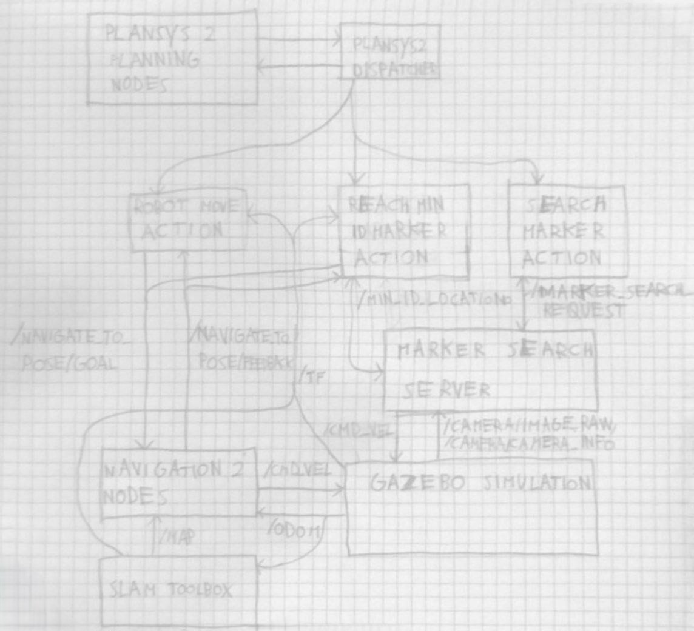

# Experimental robotics assignment 2
## project diagram
below a diagram of the various nodes and of how they are connected:

## interfaces details
As shown in the previous diagram, a few service interfaces were developed specifically for this project:
- `marker_search_request`: service, current position sent as request, boolean and marker id (if any present on the screen) sent as response;
- `min_id_location`: service, empty request, geometry_msgs/msg/PoseStamped sent as response;

## nodes behaviour 

Here are described the behaviours of the implemented nodes:
- `robot_move_action`: this action executor client node, when activated from the plan dispatcher, gets the target location from the arguments provided by the plan dispatcher (as a string) and sends the PoseStamped location (stored in an internal `map<string, geometry_msgs::msg::posestamped>`at the corresponding location argument) as goal to the `navigate_to_pose` action provided by navigation2 and regularly sends feedback on the progress to plansys2;
- `marker_search_server`: this node provides two services:
° `marker_search_request`: after receiving a call of this service the node searches for markers inside of the latest received image from the camera and sends the result of the search (true if at least a marker found, false if no marker detected in the image) and the Id of the detected marker, it also stores the PoseStamped sent as request in an ordered dictionary using the marker's ID as key; this node also
makes the robot rotate counterclockwise if no marker is detected in the current image (and stop rotate if a marker is detected);
° `min_id_location`: with this service the node is tasked with sending as response the PoseStamped paired with the lowest marker id stored in the dictionary;
- `search_marker_action`: this action executor client node upon activation repeatedly calls the service `marker_search_request` (using the same method of `robot_move_action` to obtain the goal posestamped) and sends feedback about the result until a marker is detected;
- `reach_min_id_action`: this action executor client node calls the service `min_id_location` to receive the position of the marker with minimum ID (final target of the program) and then uses the service's response as goal for the `navigate_to_goal` action.

## planning files location
The .pddl files used for the planning of the actions inside of plansys2 are located in the folder `robot_exploration/planning_files`.

## installation
To install clone this repository in the `src` folder of a ros foxy workspace and build the workspace.

## running the program 
To run the program you need to use 3 terminals:
- in the first one run the command `ros2 launch robot_exploration gazebo_assignment.launch.py` (this launchfile starts the gazebo simulation, rviz, the slam toolbox and the navigation2 2 nodes automatically using the parameter files contained in the folder config);
- in the second terminal run the command `ros2 launch robot_exploration plan_assignment_launch.py` (this launchfile starts the plansys2 system and the 4 nodes implemented for the task);
- in the third terminal run the "plansys2 terminal interface" (`ros2 run plansys2_terminal plansys2_terminal`), then load the porblem by copying and pasting in the interface the lines 1-27 of the file `problem_load_lines/problem_load_lines.txt` (you can also copy and paste from line 1 to some of the lines after 27 to set a different goal from the one required for the program but still belonging to the planning domain).

